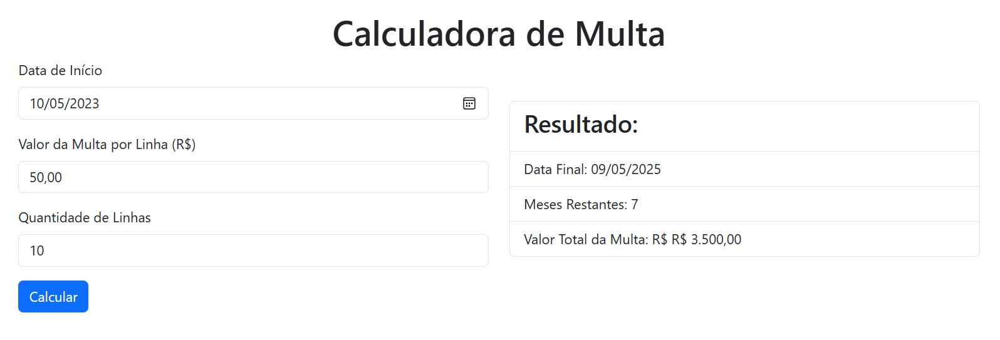

### Sistema para calcular multa plano Claro Empresas

#### Utilização
```branch
- git clone https://github.com/ricardochomicz/fine-calculator.git fine-calculator
- cd fine-calculator
- python main.py
````

http://localhost:5000/multa


